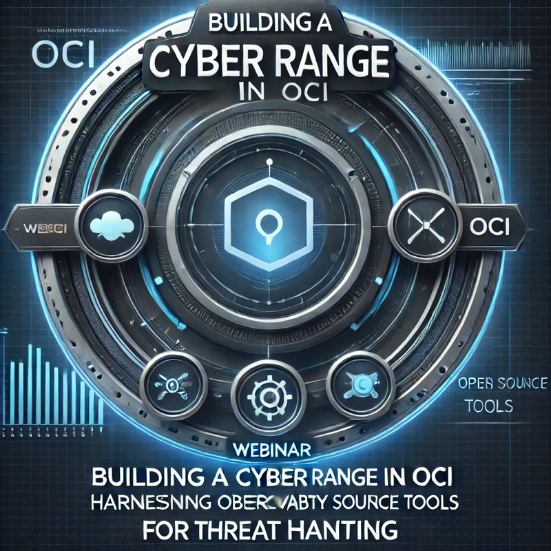

# Building a Cyber Range in OCI. Harnessing Observability and OpenSource Tools for Threat Hunting

Webinar resources

Join us for an interactive webinar designed for cybersecurity professionals and cloud enthusiasts looking to enhance their threat-hunting capabilities. In this session, we will explore how to build a dynamic cyber range in Oracle Cloud Infrastructure (OCI). A cyber range is a simulated environment where organizations can test their defenses, train teams, and uncover vulnerabilities.

You’ll learn how to:
Leverage OCI Observability tools like Cloud Guard, Logging, and Logging Analytics to monitor and analyze threats.
Integrate powerful open-source tools such as OSQuery, Arkime, and Suricata for real-time threat detection and analysis.
Simulate realistic attack scenarios in the cyber range to strengthen incident response skills.
Build a seamless workflow to correlate logs from multiple sources, detect anomalies, and proactively address Advanced Persistent Threats (APTs).This hands-on webinar is perfect for SOC analysts, IT administrators, and security architects aiming to build robust, scalable security operations using OCI and open-source technologies.

https://youtu.be/hFGeT5pQOrw?si=SHxXgHt9EAAlYYbB 

