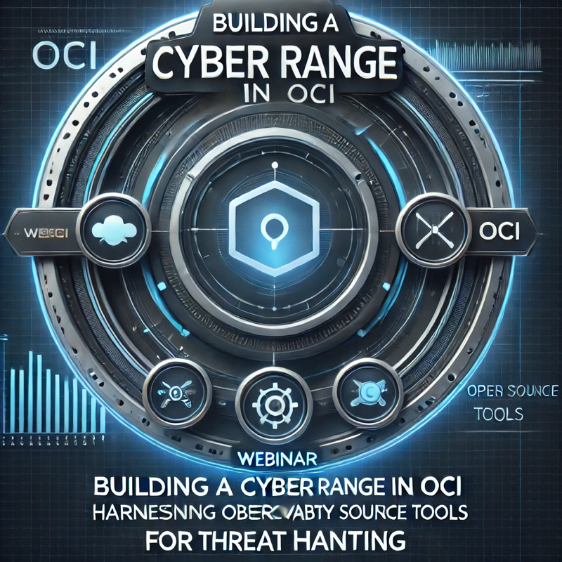

Topics that will be covered

1 - Discuss about the advantages of having a Cyber Range and adversary emulation in OCI

https://ecs-org.eu/ecso-uploads/2023/05/2020_SWG-5.1_paper_UnderstandingCyberRanges_final_v1.0-update.pdf 
https://www.ibm.com/think/topics/cyber-range 
https://github.com/center-for-threat-informed-defense/adversary_emulation_library/
https://github.com/Orange-Cyberdefense/GOAD 

2- Discuss on the Build-in capabilitities from Security and Observability perspective
Quick show of [Logging](https://docs.oracle.com/en-us/iaas/Content/Logging/Concepts/loggingoverview.htm), [Cloud Guard](https://docs.oracle.com/en-us/iaas/cloud-guard/home.htm) and [Cloud Guard Query](https://docs.oracle.com/en-us/iaas/cloud-guard/using/queries-about.htm#queries-about), [Logging Analytics](https://docs.oracle.com/en-us/iaas/logging-analytics/doc/logging-analytics1.html)

3- Present how to install [GOADv2](https://medium.com/learnoci/how-to-run-game-of-active-directory-in-oci-part-1-5be51387a7a2) and [GOADv3](https://github.com/adibirzu/GOADv3/tree/main) in OCI

4- Present some How Guides on how to install [Arkime](https://medium.com/learnoci/how-to-install-arkime-moloch-using-embedded-open-search-19a7a58f8eff), [Security Onion](https://learnoci.cloud/how-to-install-security-onion-on-oci-9c968031718a), [Caldera](https://learnoci.cloud/leveraging-caldera-in-oracle-cloud-infrastructure-oci-a-comprehensive-guide-1e59ce5015fb), [Suricata](https://medium.com/learnoci/how-to-install-suricata-in-oci-and-send-the-logs-to-logging-analytics-53587e691fbc) on OCI

5- Demo on how to install Management agent on Windows + Sysmon
https://medium.com/learnoci/how-to-ingest-windows-logs-into-logging-analytics-ec9fa591edc5
6- Demo on how to create a new parser for Sysmon in Logging Analytics
https://learnoci.cloud/how-to-get-sysmon-events-into-logging-analytics-798eec1e57d5
7 - Demo on Suricata log collection in Logging Analytics
8 - Demo on Caldera attack on GOAD Infra and show the Alerting option in Logging Analytics.
https://medium.com/learnoci/leveraging-caldera-in-oracle-cloud-infrastructure-oci-a-comprehensive-guide-1e59ce5015f

  
Some Resources on Active Directory:  

  
From Zero to Hero: Beginner’s Guide to Active Directory  
https://www.youtube.com/live/XwOV7HpVLEA
  
New Methods to Attack & Defend Active Directory  
https://www.youtube.com/live/rSgj-oMxG0g
  
Your Active Directory Active Defense ADAD Primer 
https://www.youtube.com/watch?v=TA5G2tOrVAo
  
Weaponizing Active Directory  
https://www.youtube.com/watch?v=vLWGJ3f3-gI
  
Active Directory Best Practices That Frustrate Pentesters  
https://www.youtube.com/watch?v=SdNPUhzYTUc  
  
Blogs - https://www.blackhillsinfosec.com/tag/active-directory/
